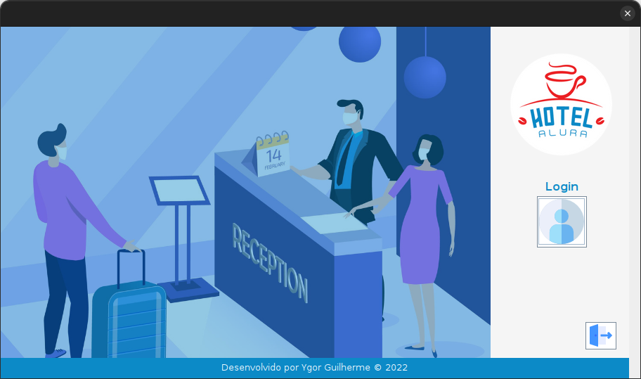
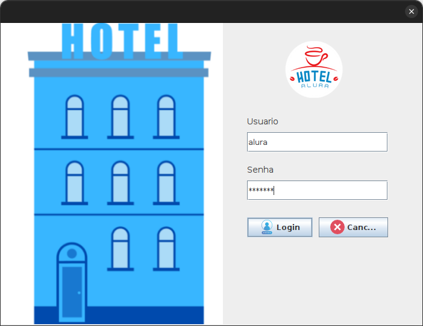
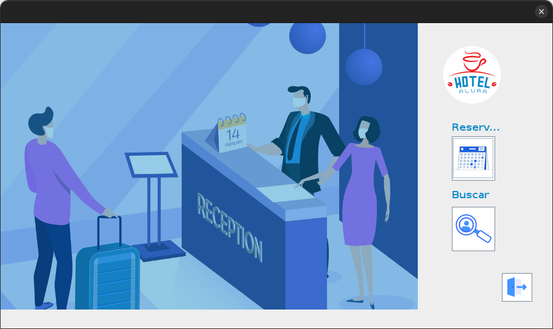
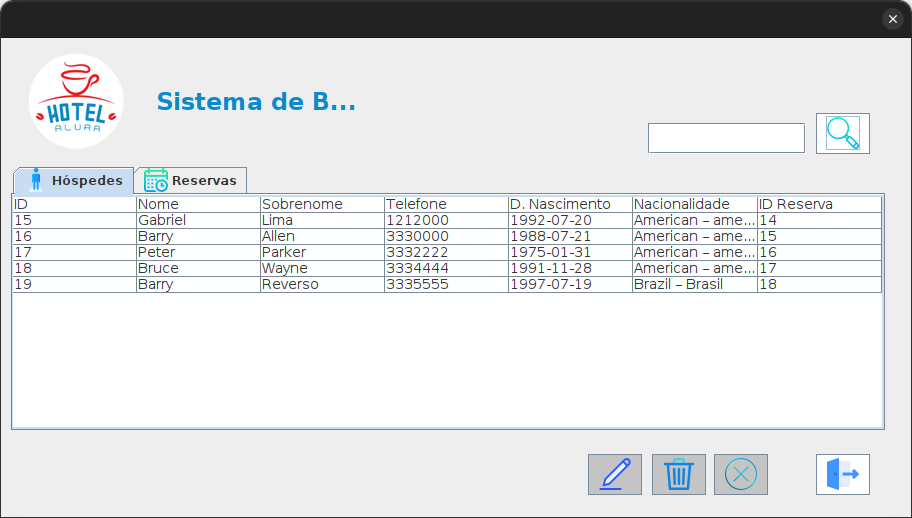
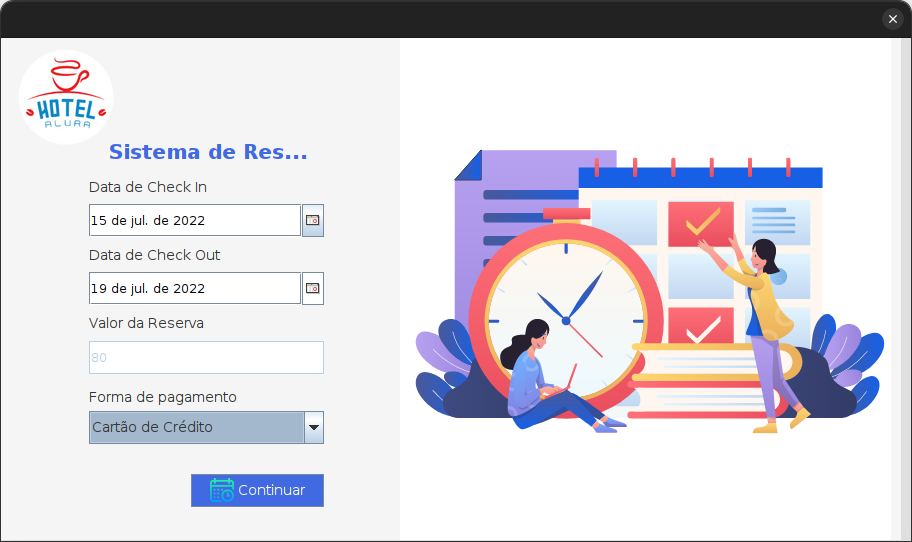
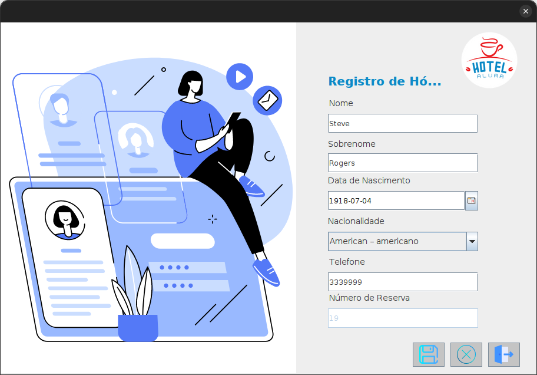

## Sobre

Alura Hotel é um aplicação para gerenciar cadastro, para hospedagem de clientes no hotel.

## Ferramentas Utilizadas

Sua criação foi em java utilizando a biblioteca swing para interface grafica e disponibilizada pela alura (link codigo da GUI)[https://github.com/alura-challenges/challenge-one-alura-hotel-br]

Java
Mysql
Biblioteca JCalendar
Biblioteca C3P0

## Objetivo

Meu objetivo era criar a parte lógica e conectar a aplicação como banco de dados no caso utlizado o mysql, no desenvolvimento utilizei o padrão MVC - Model View Controller, para organizar e estrutura a aplicação.

Criei metodos para fazer requisição ao banco de dados, requisições essas de pega informações, adicionar, remover e atualizar. Toda a ação que for feita na GUI será reflitido no banco de dados.

